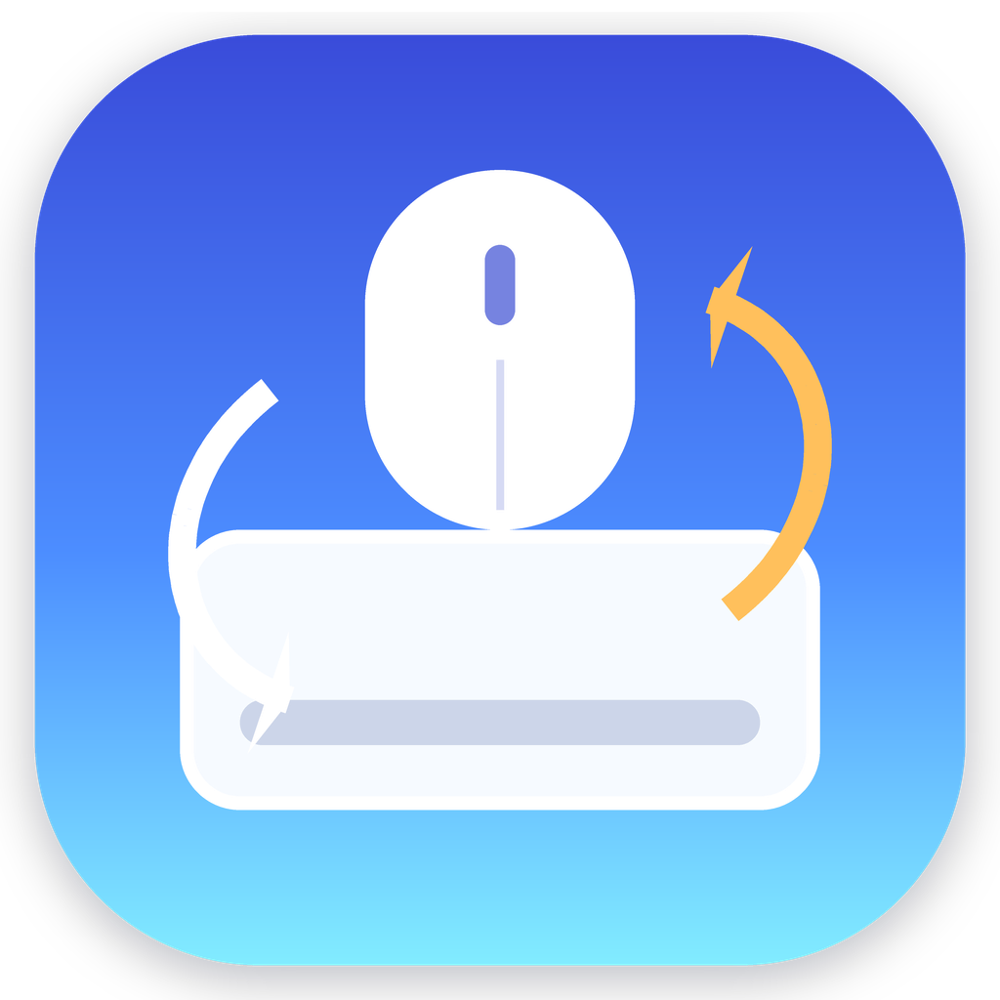

# NaturalScrollSwitcher

一个轻量、安静的 macOS 菜单栏工具：自动根据你正在使用鼠标还是触控板，切换系统“自然滚动”方向。

[](https://github.com/TJUgsmw/NaturalScrollSwitcher/actions)

<p align="center">
  
</p>

## 中文简介

macOS 的“自然滚动”是全局设置，系统没有给鼠标和触控板分别保存两个开关。NaturalScrollSwitcher v0.6.5 会根据当前权限自动选择最可用的运行方式：权限完整时把系统全局设置固定为触控板偏好，并用事件修正即时处理鼠标滚轮；只有输入监控时回退到全局设置切换；没有监听权限时仍保留手动切换。

- 检测到普通鼠标滚轮时，完整权限下会直接修正鼠标滚轮事件；默认是关闭自然滚动。
- v0.6.0 起会同时监听 HID 鼠标滚轮输入，普通 USB/蓝牙滚轮鼠标不再只依赖 macOS 的连续滚动字段判断。
- v0.6.5 起 HID 鼠标滚轮监听不再只匹配 `Mouse` 设备，也会捕获把滚轮挂在其他 HID 集合下的蓝牙鼠标。
- 检测到触控板连续滚动或手势时，系统基线保持触控板偏好；默认是开启自然滚动。
- v0.6.5 起写入系统自然滚动设置后会刷新 macOS 偏好守护进程，降低“读回已成功但当前 App 还没生效”的概率。
- 事件级修正会按当前基线和对应设备偏好决定是否修正，避免依赖 macOS 立刻重读全局自然滚动设置。
- v0.6.4 起会把事件识别结果写入 `~/Library/Logs/NaturalScrollSwitcher/events.log`，便于排查具体设备字段。
- 如果辅助功能权限缺失或 macOS 拒绝可修改事件监听，会自动退回到写入系统自然滚动设置。
- 如果输入监控权限缺失，自动检测会停用，但菜单里的手动鼠标/触控板切换仍可写入系统设置。
- App 启动时只读取权限状态，不会每次自动弹权限请求；只有点击菜单里的“请求权限...”才会主动请求。
- 默认保持常见习惯：鼠标自然滚动关闭，触控板自然滚动开启。
- 你也可以在菜单里分别选择鼠标和触控板是否开启自然滚动。
- App 菜单会跟随 macOS 系统语言显示中文或英文。
- v0.4.0 起包含自定义 App 图标、菜单栏图标和拖拽安装 DMG 界面。
- v0.5.1 起包含运行模式诊断，用来确认当前是事件修正、全局回退还是仅手动。

## 下载和安装

从 [Releases](https://github.com/TJUgsmw/NaturalScrollSwitcher/releases) 下载最新版本的 `.dmg` 或 `.zip`，然后打开 `NaturalScrollSwitcher.app`。

当前默认下载包是本地 ad-hoc 签名，没有 Apple notarization。如果 macOS 提示“无法验证开发者”，可以在“系统设置 -> 隐私与安全性”里允许打开。

如果你频繁自己重新构建并替换 App，建议用固定代码签名身份打包。ad-hoc 签名的权限身份是每次构建变化的 `cdhash`，macOS 可能会要求你重新授予输入监控/辅助功能权限。

首次运行后，请给 App 授权：

1. 点击菜单栏里的 `NS On` 或 `NS Off`。
2. 选择“请求权限...”或打开“输入监控设置”。
3. 在系统设置中为 `NaturalScrollSwitcher.app` 启用输入监控权限和辅助功能权限。
4. 退出并重新打开 App。

事件级滚动修正需要输入监控和辅助功能权限。只有输入监控权限时，App 会进入“全局设置回退”模式，仍会根据鼠标/触控板输入切换系统自然滚动设置。菜单里会显示当前权限和运行模式。

## 使用说明

菜单项会根据系统语言显示中文或英文。中文环境下主要菜单包括：

- `自动切换`：启用或暂停自动识别鼠标/触控板。
- `鼠标自然滚动`：勾选后，鼠标模式会开启自然滚动；取消勾选则关闭。
- `触控板自然滚动`：勾选后，触控板模式会开启自然滚动；取消勾选则关闭。
- `运行模式`：显示当前是“事件修正”“全局设置回退”还是“仅手动”。
- `切换到鼠标: 自然滚动开启/关闭`：立即切到鼠标偏好；事件修正模式下保持触控板系统基线，回退/手动模式下写入系统设置。
- `切换到触控板: 自然滚动开启/关闭`：立即切到触控板偏好，并同步触控板系统基线。
- `最近动作`：显示最近滚动是否被修正，例如“已修正鼠标滚动”或“触控板滚动未修正”。
- `打开输入监控设置`：打开 macOS 输入监控权限页面。
- `打开辅助功能设置`：打开 macOS 辅助功能权限页面。

Magic Mouse 的滚动事件更接近触控设备，v0.6.5 暂不承诺稳定识别。普通 USB/蓝牙滚轮鼠标是当前主要支持目标。

## 从源码构建

项目使用 Swift Package + AppKit，不需要 Xcode 工程文件。

```sh
python3 -m venv .venv
.venv/bin/python -m pip install pillow
swift run NaturalScrollSelfTest
swift build -c release
PATH="$PWD/.venv/bin:$PATH" ./scripts/build_app.sh
```

生成的 App 在：

```text
dist/NaturalScrollSwitcher.app
```

如需稳定本机权限，使用固定签名身份：

```sh
CODESIGN_IDENTITY="Your Code Signing Identity" ./scripts/package_release.sh
```

如果签名身份在单独 keychain 中：

```sh
CODESIGN_IDENTITY="Your Code Signing Identity" \
CODESIGN_KEYCHAIN="/path/to/keychain" \
./scripts/package_release.sh
```

可以用下面的命令检查当前 App 是否仍是 ad-hoc 签名。若输出只有 `cdhash`，说明每次重新构建后 macOS 都可能要求重新授权：

```sh
codesign -dr - dist/NaturalScrollSwitcher.app
```

## 打包 Release

```sh
./scripts/package_release.sh
```

会生成：

```text
dist/NaturalScrollSwitcher-0.6.5-macos-<arch>.zip
dist/NaturalScrollSwitcher-0.6.5-macos-<arch>.dmg
dist/checksums.txt
```

推送 tag 后，GitHub Actions 会自动构建并创建 Release：

```sh
git tag v0.6.5
git push origin v0.6.5
```

## 隐私

见 [docs/PRIVACY.md](docs/PRIVACY.md)。简短版本：App 只在本机监听滚动/手势事件元信息，用来判断输入来源；不记录键盘输入，不联网，不上传数据，不包含分析统计。

---

## English

NaturalScrollSwitcher is a small macOS menu bar utility that gives ordinary mouse wheels and trackpads separate natural scrolling behavior.

macOS exposes natural scrolling as one global setting. v0.6.5 chooses the best available runtime mode: a fixed trackpad system baseline plus event-level mouse wheel correction when both permissions are available, global setting fallback when only Input Monitoring is available, and manual-only switching when automatic input detection is unavailable.

### Features

- Mouse wheel input is corrected immediately in Event Correction mode.
- HID-level mouse wheel detection improves classification for ordinary USB/Bluetooth wheel mice.
- v0.6.5 broadens HID wheel monitoring to devices that expose their wheel outside the standard mouse collection.
- Trackpad continuous scroll or gesture input keeps the macOS global baseline aligned with the trackpad preference.
- Preference writes refresh macOS preferences services to reduce stale natural scrolling behavior after programmatic writes.
- Event-level correction compares the active system baseline with each device preference instead of relying on macOS to reload the global setting immediately.
- Local event diagnostics are written to `~/Library/Logs/NaturalScrollSwitcher/events.log`.
- Automatic fallback to global natural scrolling setting sync when editable event taps are unavailable.
- The app no longer requests permissions automatically on every launch.
- Manual mouse and trackpad switches apply the selected preference; Event Correction mode keeps the trackpad baseline, while fallback/manual modes write the selected system setting.
- Defaults: natural scrolling off for mouse, on for trackpad.
- Separate menu preferences for mouse and trackpad natural scrolling.
- Runtime mode and recent-action diagnostics.
- Chinese or English menu text based on the macOS preferred language.
- Custom app icon, menu bar icon, and polished drag-to-Applications DMG.
- Local packaging scripts for `.app`, `.zip`, and `.dmg` artifacts.

### Install

Download the latest `.dmg` or `.zip` from [Releases](https://github.com/TJUgsmw/NaturalScrollSwitcher/releases), then open `NaturalScrollSwitcher.app`.

The default package is ad-hoc signed for local use and is not notarized by Apple. macOS may show a first-run security warning.

On first launch, grant both Input Monitoring and Accessibility permissions. Event-level correction requires both permissions. With only Input Monitoring, the app still switches through the global setting fallback.

For repeated local rebuilds, sign with a persistent identity to avoid macOS TCC treating each rebuilt app as a new `cdhash` identity:

```sh
CODESIGN_IDENTITY="Your Code Signing Identity" ./scripts/package_release.sh
```

### Build

```sh
python3 -m venv .venv
.venv/bin/python -m pip install pillow
swift run NaturalScrollSelfTest
swift build -c release
PATH="$PWD/.venv/bin:$PATH" ./scripts/package_release.sh
```

### Notes

Magic Mouse is not a stable v0.6.5 target because its scroll events are closer to touch devices than ordinary mouse wheels.
