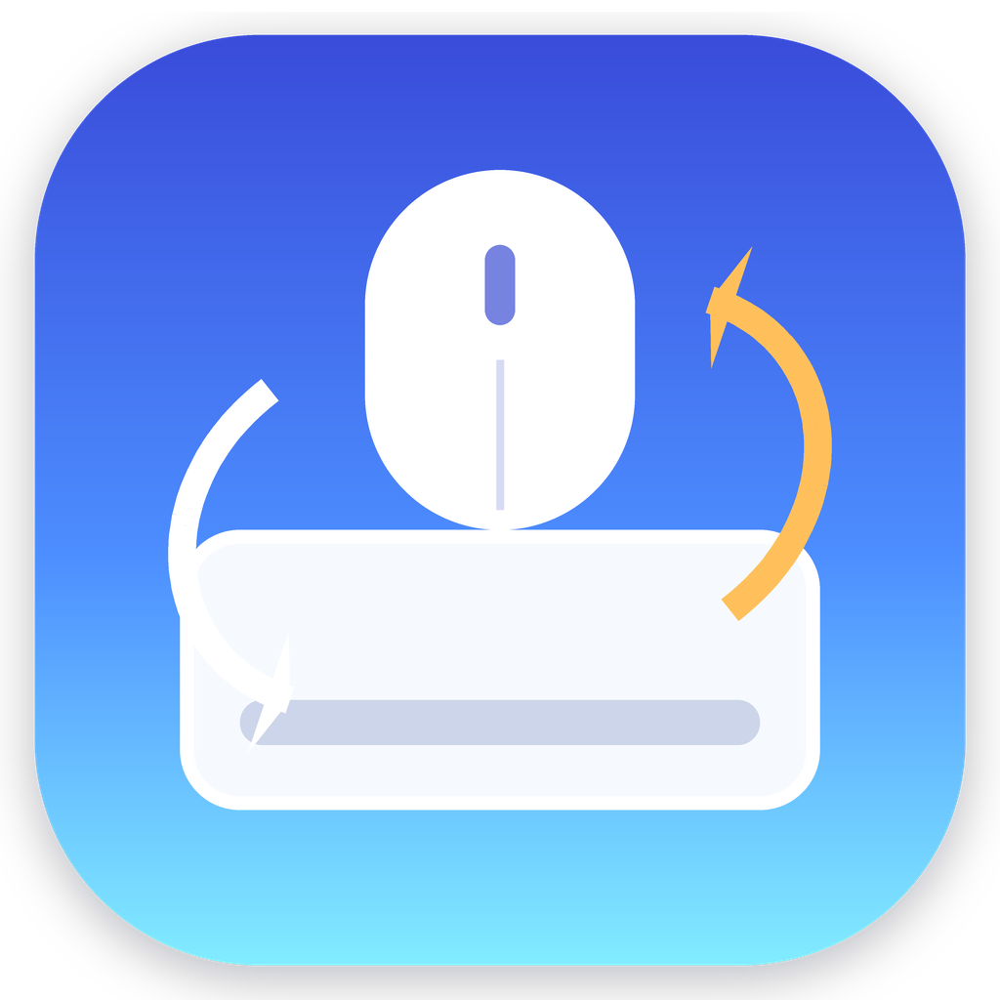

# NaturalScrollSwitcher

一个轻量、安静的 macOS 菜单栏工具：自动根据你正在使用鼠标还是触控板，切换系统“自然滚动”方向。

[](https://github.com/TJUgsmw/NaturalScrollSwitcher/actions)

<p align="center">
  
</p>

## 中文简介

macOS 的“自然滚动”实际上是鼠标和触控板共用的一个全局设置。NaturalScrollSwitcher v0.7.2 根据当前输入设备切换系统自然滚动，并针对 macOS 27 的高频手势和菜单栏更新优化耗电。

- 检测到普通鼠标滚轮时，立即把系统自然滚动切换为鼠标偏好；默认关闭。
- 同时监听 HID 滚轮值，支持把滚轮挂在其他 HID 集合下的 USB/蓝牙鼠标；不接收无关 HID 输入值。
- 检测到触控板时，立即把系统自然滚动切换为触控板偏好；默认开启。
- 同步系统实时设置和保存值，仅在输入设备变化时更新设置和界面。
- 诊断日志只记录启动、运行状态变化和设置写入，后台写入，最大 1 MiB；详细事件字段默认关闭。
- 如果输入监控权限缺失，自动检测会停用，但菜单里的手动鼠标/触控板切换仍可写入系统设置。
- App 启动时只读取权限状态，不会每次自动弹权限请求；只有点击菜单里的“请求权限...”才会主动请求。
- 默认保持常见习惯：鼠标自然滚动关闭，触控板自然滚动开启。
- 你也可以在菜单里分别选择鼠标和触控板是否开启自然滚动。
- App 菜单会跟随 macOS 系统语言显示中文或英文。
- v0.4.0 起包含自定义 App 图标、菜单栏图标和拖拽安装 DMG 界面。
- 菜单显示当前输入设备、系统设置、权限和运行状态。

## 下载和安装

从 [Releases](https://github.com/TJUgsmw/NaturalScrollSwitcher/releases) 下载最新版本的 `.dmg` 或 `.zip`，然后打开 `NaturalScrollSwitcher.app`。

当前默认下载包是本地 ad-hoc 签名，没有 Apple notarization。如果 macOS 提示“无法验证开发者”，可以在“系统设置 -> 隐私与安全性”里允许打开。

如果你频繁自己重新构建并替换 App，建议用固定代码签名身份打包。ad-hoc 签名的权限身份是每次构建变化的 `cdhash`，macOS 可能会要求你重新授予输入监控权限。

首次运行后，请给 App 授权：

1. 点击菜单栏里的 `NS On` 或 `NS Off`。
2. 选择“请求权限...”或打开“输入监控设置”。
3. 在系统设置中为 `NaturalScrollSwitcher.app` 启用输入监控权限。
4. 退出并重新打开 App。

自动切换只需要输入监控权限，不再需要辅助功能权限。菜单里会显示当前权限和运行模式。

## 使用说明

菜单项会根据系统语言显示中文或英文。中文环境下主要菜单包括：

- `自动切换`：启用或暂停自动识别鼠标/触控板。
- `鼠标自然滚动`：勾选后，鼠标模式会开启自然滚动；取消勾选则关闭。
- `触控板自然滚动`：勾选后，触控板模式会开启自然滚动；取消勾选则关闭。
- `运行模式`：有输入监控权限时显示“全局设置回退”（直接切换系统设置），否则显示“仅手动”。
- `切换到鼠标: 自然滚动开启/关闭`：立即按鼠标偏好写入系统自然滚动设置。
- `切换到触控板: 自然滚动开启/关闭`：立即按触控板偏好写入系统自然滚动设置。
- `最近动作`：显示最近一次设备切换写入的系统设置。
- `打开输入监控设置`：打开 macOS 输入监控权限页面。

Magic Mouse 的滚动事件更接近触控设备，暂不承诺稳定识别。普通 USB/蓝牙滚轮鼠标是当前主要支持目标。

## 从源码构建

项目使用 Swift Package + AppKit，不需要 Xcode 工程文件。

```sh
python3 -m venv .venv
.venv/bin/python -m pip install pillow
swift run NaturalScrollSelfTest
swift build -c release
PATH="$PWD/.venv/bin:$PATH" ./scripts/build_app.sh
```

生成的 App 在：

```text
dist/NaturalScrollSwitcher.app
```

如需稳定本机权限，使用固定签名身份：

```sh
CODESIGN_IDENTITY="Your Code Signing Identity" ./scripts/package_release.sh
```

如果签名身份在单独 keychain 中：

```sh
CODESIGN_IDENTITY="Your Code Signing Identity" \
CODESIGN_KEYCHAIN="/path/to/keychain" \
./scripts/package_release.sh
```

可以用下面的命令检查当前 App 是否仍是 ad-hoc 签名。若输出只有 `cdhash`，说明每次重新构建后 macOS 都可能要求重新授权：

```sh
codesign -dr - dist/NaturalScrollSwitcher.app
```

## 打包 Release

```sh
./scripts/package_release.sh
```

会生成：

```text
dist/NaturalScrollSwitcher-0.7.2-macos-<arch>.zip
dist/NaturalScrollSwitcher-0.7.2-macos-<arch>.dmg
dist/checksums.txt
```

推送 tag 后，GitHub Actions 会自动构建并创建 Release：

```sh
git tag v0.7.2
git push origin v0.7.2
```

## 隐私

见 [docs/PRIVACY.md](docs/PRIVACY.md)。简短版本：App 只在本机监听滚动/手势事件元信息，用来判断输入来源；不记录键盘输入，不联网，不上传数据，不包含分析统计。

---

## English

NaturalScrollSwitcher is a small macOS menu bar utility that gives ordinary mouse wheels and trackpads separate natural scrolling behavior.

macOS exposes natural scrolling as one global setting shared by mouse and trackpad. v0.7.2 applies each device's preference to that live setting and reduces CPU use from high-frequency gestures and status bar updates on macOS 27.

### Features

- Mouse wheel input applies the configured mouse preference to the live system setting.
- HID-level mouse wheel detection improves classification for ordinary USB/Bluetooth wheel mice.
- HID matching supports wheels outside the standard mouse collection while filtering out unrelated input values.
- Trackpad input applies the configured trackpad preference to the live system setting.
- Updates the live system setting and stored preference only when the input device changes.
- Bounded background diagnostics at `~/Library/Logs/NaturalScrollSwitcher/events.log`; detailed snapshots are disabled by default.
- No permanent permission polling when authorized; checks on menu opening, wake, and session activation.
- The app no longer requests permissions automatically on every launch.
- Manual mouse and trackpad switches always write the selected system setting.
- Defaults: natural scrolling off for mouse, on for trackpad.
- Separate menu preferences for mouse and trackpad natural scrolling.
- Runtime mode and recent-action diagnostics.
- Chinese or English menu text based on the macOS preferred language.
- Custom app icon, menu bar icon, and polished drag-to-Applications DMG.
- Local packaging scripts for `.app`, `.zip`, and `.dmg` artifacts.

### Install

Download the latest `.dmg` or `.zip` from [Releases](https://github.com/TJUgsmw/NaturalScrollSwitcher/releases), then open `NaturalScrollSwitcher.app`.

The default package is ad-hoc signed for local use and is not notarized by Apple. macOS may show a first-run security warning.

On first launch, grant Input Monitoring permission and reopen the app. Accessibility permission is not required. Manual switching remains available without Input Monitoring.

For repeated local rebuilds, sign with a persistent identity to avoid macOS TCC treating each rebuilt app as a new `cdhash` identity:

```sh
CODESIGN_IDENTITY="Your Code Signing Identity" ./scripts/package_release.sh
```

### Build

```sh
python3 -m venv .venv
.venv/bin/python -m pip install pillow
swift run NaturalScrollSelfTest
swift build -c release
PATH="$PWD/.venv/bin:$PATH" ./scripts/package_release.sh
```

### Notes

Magic Mouse is not a stable target because its scroll events are closer to touch devices than ordinary mouse wheels.

### Local Diagnostics

The diagnostic log is capped at 1 MiB. To include detailed snapshots of source transitions, quit the app and launch the executable with `NSS_VERBOSE_EVENTS=1`.

For a repeatable performance check, compile `scripts/gesture_load_probe.swift` with `swiftc -O` and run it for 10 seconds while measuring the app in Activity Monitor or `top`. It sends 240 zero-payload gesture events per second without moving the pointer. The listener will select the trackpad preference, so this check changes the natural scrolling setting. The `--mouse` option sends zero-delta wheel events to check mouse detection without scrolling the foreground app.
